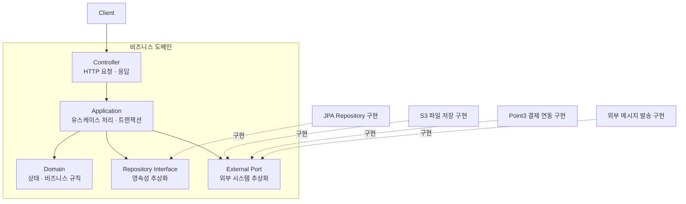
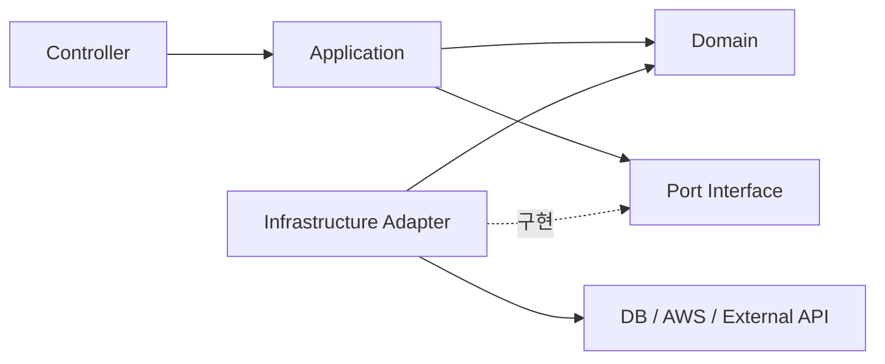

# 프로젝트 아키텍처

해당 프로젝트의 아키텍처는 **도메인별 패키지 구조**와 **유스케이스 중심의 Application 계층**을 사용합니다.

각 도메인의 Application 계층은 생성, 수정, 삭제, 조회와 같은 **유스케이스 단위**로 분리합니다.

---

# 기본 전략

- 패키지는 기술 계층보다 **비즈니스 도메인**을 기준으로 분리
- Controller는 도메인 단위로 구성 (과분리 방지)
- Application 계층은 유스케이스별로 분리
- Domain Model과 JPA Entity는 별도로 분리하지 않음
- 비즈니스 규칙은 Domain 객체 내부에 위치
- 외부 시스템 연동은 **Port Interface + Infrastructure 구현체**로 분리
- Infrastructure 계층은 Application 또는 Domain에서 정의한 인터페이스를 구현
- 내부 계층은 Infrastructure 구현체를 직접 참조하지 않음

---

# 패키지 구조

```text
domain-name
├── controller
│   ├── 요청 처리
│   └── 응답 반환
│
├── application
│   ├── create
│   ├── update
│   ├── delete
│   ├── query
│   └── port
│
├── domain
│   ├── entity
│   ├── value
│   ├── repository
│   └── business-rule
│
└── infrastructure
    ├── persistence
    └── external
```

---

# 계층별 역할

## Controller

- HTTP 요청을 받아 적절한 유스케이스 호출
- 결과를 응답으로 반환
- Controller에는 비즈니스 규칙을 작성하지 않음

예시

- 상품 등록
- 상품 수정
- 주문 생성
- 주문 취소
- 주문 목록 조회
- 결제 완료 처리

---

## Application

하나의 사용자 행동(Use Case)을 처리합니다.

역할

- 처리 순서 조율
- 트랜잭션 관리
- Domain 호출
- Port 호출

---

## Domain

비즈니스 상태와 규칙을 표현합니다.

- 도메인 모델은 JPA Entity 역할도 수행
- 상태 변경은 가능한 Domain 메서드를 통해 수행

예시

- 주문 취소 가능 여부 검증
- 상품 판매 상태 변경
- 결제 상태 전환
- 재고 감소

Repository Interface 역시 Domain 계층에 위치합니다.

---

## Port

Application 계층이 외부 시스템을 사용하기 위해 정의하는 인터페이스입니다.

예시

- 파일 저장소
- 결제 시스템
- 알림 전송

---

## Infrastructure

DB, AWS, 외부 API 등 기술적인 구현을 담당합니다.

예시

- JPA Repository 구현
- S3 파일 저장 구현
- Point3 결제 연동 구현
- 외부 메시지 발송 구현

Infrastructure는 Application 또는 Domain에서 정의한 인터페이스를 구현합니다.

---

# 계층 및 의존 방향



Application 계층은 S3, Point3와 같은 구체적인 기술을 직접 참조하지 않고 Port 인터페이스에 의존합니다.

---

# 의존성 규칙



---

# 핵심 원칙

> 실행 흐름과 코드 의존 방향은 다릅니다.

실행 시에는

```
Application
    ↓
Infrastructure 구현체
```

가 호출되지만,

코드 의존성은

```
Application
    ↓
Port Interface
```

만 바라봅니다.

즉, Application은 구현체가 아닌 **Port Interface**에만 의존하고, 실제 구현은 Infrastructure에서 담당합니다.